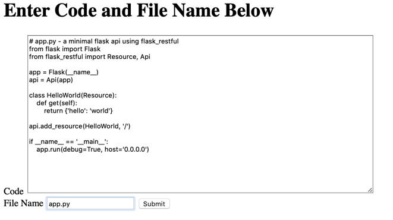
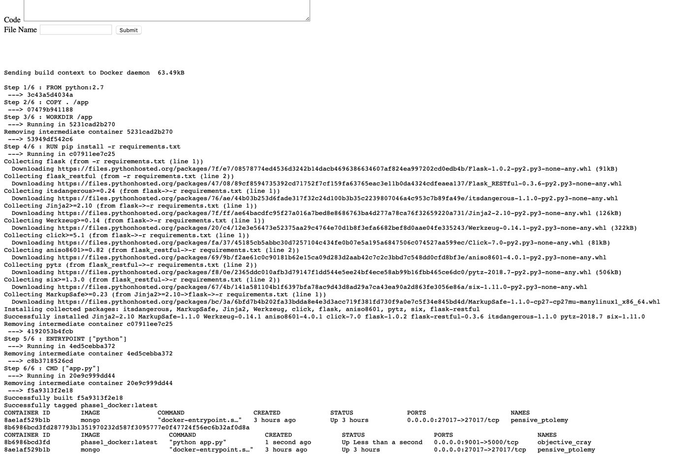

## Working with docker and browser
Download Docker, install it and learn how it works. Create a web interface where you can input (“TextBox”) a small 
rogram in any language of your choice, and a command (“button”) that will load the program in the Docker and execute it. 
The result of execution is display on the web output area.

## Code style
PEP 8 for python

[](https://github.com/feross/standard)

## Tech/framework used
<b>Technologies used</b>
- [python](http://python.org) <br />
- [flask](http://flask.pocoo.org) <br />
- [docker](https://www.docker.com) <br />

<b>Built with</b>
- [Intellij IDEA](https://www.jetbrains.com/idea/) <br />

## Installation and setup

Open terminal <br />

<b>Install the necessary python packages</b> <br />
pip install pymongo <br />
pip install flask <br />

<b>Install docker in your system </b> <br />
https://docs.docker.com/install/  <br />

cd ProjectFolder/p2v1  <br />
rm app.py logfile.txt  <br />


## Tests

Open terminal <br />
<b>Start the flask server</b> <br />
cd ProjectFolder/p2v1  <br />
python main.py & <br />

<b> open the browser.</b> <br />
Open the browser on the url '0.0.0.0:9000'<br />

In the input box provided for entering the code snippet
```python
# app.py - a minimal flask api using flask_restful
from flask import Flask
from flask_restful import Resource, Api

app = Flask(__name__)
api = Api(app)

class HelloWorld(Resource):
    def get(self):
        return {'hello': 'world'}

api.add_resource(HelloWorld, '/')

if __name__ == '__main__':
    app.run(debug=True, host='0.0.0.0')

```


## How to use?
Start the flask server <br/>
cd ProjectFolder/p2v1  <br />
python main.py & <br />



<br />


## Credits
http://flask.pocoo.org<br />
https://www.python.org<br />
https://www.docker.com<br />


## License
MIT © [rishi, divya 2018]()