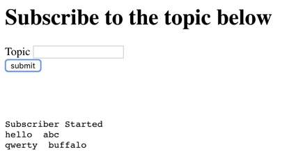
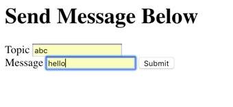

## EMULATING PUB/SUB DISTRIBUTED SYSTEM USING DOCKER CONTAINERS
The purpose of the project is to implement the pub/sub system with publishers and subscribers. The publishers 
publish a message to a topic and the pub/sub system delivers said message to all the subscribers that are subscribed to 
a topic.

## Motivation
The motivation behind the project is to learn the following.
1) Building systems using Docker.  
2) Working with web interface to invoking Docker.  
3) Building a distributed pub/sub system.  

## Code style
PEP 8 for python

## Tech/framework used
<b>Technologies used</b>
- [python](http://python.org)  
- [flask](http://flask.pocoo.org)  
- [docker](https://www.docker.com)  

<b>Built with</b>
- [Intellij IDEA](https://www.jetbrains.com/idea/)  

## Installation and setup

Open terminal  

<b>Install the necessary python packages</b>  
pip install pymongo  
pip install flask  

<b>Install docker in your system </b>  
https://docs.docker.com/install/   

cd ProjectFolder/p2v2   
docker build -t p2v2:latest .   
docker run -d  -p 5000:5000 -p 6005:6005 -p 7005:7005 -i p2v2:latest   

## Tests

Open terminal  
<b>Start the docker container with pub/sub system</b>  
cd ProjectFolder/p2v2   
docker run -d  -p 5000:5000 -p 6000-6010:6000-6010 -p 7000-7010:7000-7010 -i p2v2:latest  

<b> open the browser.</b>  
Open the browser on the urls '0.0.0.0:6001-6005' to get the subscribers  
Open the browser on the url '0.0.0.0:7001-7005' in another tab  to get the publishers 

subscribe to one or more topics in one or more subscriber tabs.   
submit topic_name and message name in one or more publisher tabs.

## Demo

To use the pub/sub application simply go to the localhost:5000/ url and enter the source and destination in the textboxes. 
  
  

## Credits
http://flask.pocoo.org 
https://www.python.org 
https://www.docker.com 

## License
MIT © [rishi, divya 2018]()